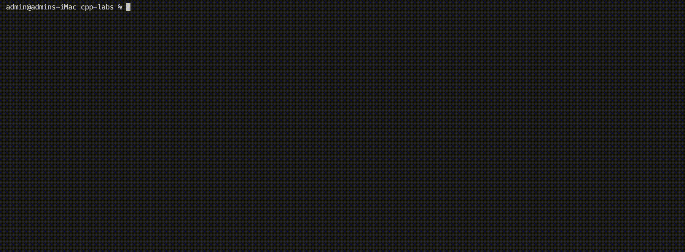

# cpp-labs

C++ sandbox project

## Install

- A compiler supporting C++17.
- CMake v3.10 or higher.

## Build

Navigate to the project root.

Create a `build` directory and navigate to it:

```shell
mkdir build && cd build
```

Build the project:

```shell
cmake ..
```

Then, in the same directory:

```shell
make
```

To compile only a specific executable:

```shell
make ExecutableName
```

e.g.,

```shell
make IncrementAndDecrementOperators
```



## Run an executable

`cd` to the directory of the example:

```shell
cd ./sections/sectionXX/YY_ExecutableName
```

e.g.,

```shell
cd ./sections/section01/02_DataTypes
```

Run the executable:

```shell
./ExecutableName
```

e.g.,

```shell
./DataTypes
```


