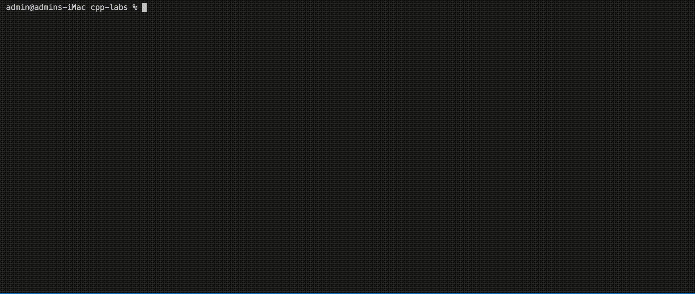

# cpp-labs

C++ sandbox project

## Install

- A compiler supporting C++17.
- CMake v3.10 or higher.

## Build

Navigate to the project root.

Create a `build` directory and navigate to it:

```shell
mkdir build
cd build
```

Build the project:

```shell
cmake ..
make
```

## Run an executable

`cd` to the directory of the example:

```shell
cd ./sections/section01/HelloWorld
```

Run the executable:

```shell
./ExecutableName
```

e.g.,

```shell
./HelloWorld
```


