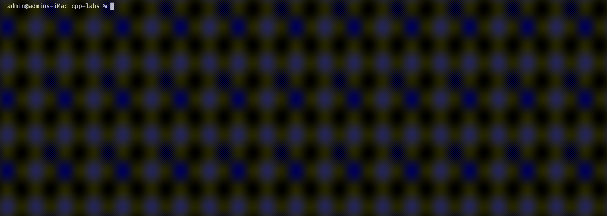

# Other unary operators

## Unary Operators and Polymorphism in C++

Besides the unary prefix and postfix increment and decrement operators, C++ supports several other unary operators, including `+`, `-`, and `&`.

When you use the `+` operator with two operands, it performs addition.
When used alone in front of an operand, it becomes the **positive value operator**, indicating a positive value -- one that is greater than zero.

When you use the `-` operator with two operands, it performs subtraction.
When used alone in front of an operand, it becomes the **negative value operator**, indicating reversing the sign, for example, turning a positive value to a negative value.

The multiple meanings of `+` and `-` should not be surprising -- they have the same multiple meanings in standard arithmetic.
You understand which meaning of `+` or `-` is appropriate at any time based on the context.
For example, you understand `14 - 8` to mean perform subtraction, and `-12` to mean a negative number.

The diverse meanings of `+` and `-` provide an example of **polymorphism** in object-oriented programming (OOP).
Object-oriented programs use polymorphism to carry out operations in a customized manner; the operators `+` and `-` carry out different processes depending on whether they are used with one or two operands.

---

## Source code

#### `OtherUnaryOperators.h`

```cpp
#ifndef OTHER_UNARY_OPERATORS_H
#define OTHER_UNARY_OPERATORS_H

int run();

#endif // OTHER_UNARY_OPERATORS_H
```

#### `OtherUnaryOperators.cpp`

```cpp
#include <iostream>
#include "OtherUnaryOperators.h"

int run()
{
    int x = 5;
    int y = 775;
    std::cout << "The value of x is " << x << " and the value of y is " << y << std::endl;
    std::cout << "The address of x is " << &x << " and the address of y is " << &y << std::endl;

    std::cout << "Running 'x = +(-10);'..." << std::endl;
    x = +(-10);
    std::cout << "The value of x is " << x << std::endl;
    return 0;
}
```

#### `main.cpp`

```cpp
#include "OtherUnaryOperators.h"

int main()
{
    run();
    return 0;
}
```

---

## Run the example


