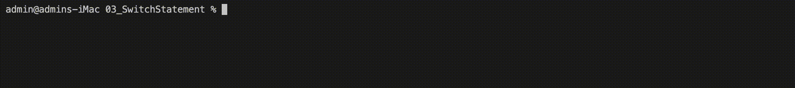

# `switch` statement

The `switch` statement in C++ allows you to execute one block of code among many choices or cases.
It is an alternative to long chains of `if-else` statements and often improves the readability of your code.
This document explains the concept and usage of the switch statement in C++17.

---

## Basic syntax

```cpp
switch(expression) {
    case constant1:
        // code to be executed if expression == constant1;
        break;

    case constant2:
        // code to be executed if expression == constant2;
        break;

    default:
        // code to be executed if expression doesn't match any constants;
}
```

The expression inside the `switch` is evaluated once.
The resulting value is compared to the values of each case.
If there's a match, the associated block of code is executed.

The `break` statement is used to exit the `switch` structure.
If omitted, execution will continue with the next case (often referred to as "falling through").

The `default` case is optional and can be used when no other case matches.

---

## Source code

#### **Example: Day of the Week**

To demonstrate, create a program that takes a number (**1**-**7**) and prints out the day of the week it corresponds to.

#### `DayOfWeekConverter.h`

```cpp
#pragma once

class DayOfWeekConverter {
public:
    static void printDay(int dayNumber);
};
```

#### `DayOfWeekConverter.cpp`

```cpp
#include "DayOfWeekConverter.h"
#include <iostream>

void DayOfWeekConverter::printDay(int dayNumber) {
    switch(dayNumber) {
        case 1:
            std::cout << "Sunday" << std::endl;
            break;

        case 2:
            std::cout << "Monday" << std::endl;
            break;

        case 3:
            std::cout << "Tuesday" << std::endl;
            break;

        case 4:
            std::cout << "Wednesday" << std::endl;
            break;

        case 5:
            std::cout << "Thursday" << std::endl;
            break;

        case 6:
            std::cout << "Friday" << std::endl;
            break;

        case 7:
            std::cout << "Saturday" << std::endl;
            break;

        default:
            std::cout << "Invalid number! Please enter a number between 1 and 7." << std::endl;
    }
}
```

#### `main.cpp`

```cpp
#include "DayOfWeekConverter.h"

int main() {
    int dayNumber;
    std::cout << "Enter a number (1-7): ";
    std::cin >> dayNumber;

    DayOfWeekConverter::printDay(dayNumber);

    return 0;
}
```

When you run the program, it will prompt you for a number.
Enter a number between **1** and **7**, and it will print the corresponding day of the week.

---

## Run the source code



---

## Conclusion

The `switch` statement offers a concise way to handle multiple choices based on a single expression.
It's essential to understand its behavior and limitations, especially regarding "fall-through" logic (if the `break` statement is omitted).
In C++17, `switch` primarily works with integral (`int`, `unsigned int`, etc.) or enumeration types.
